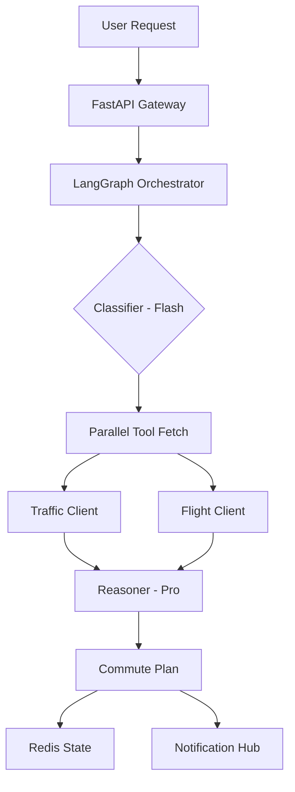

# Atlas Commute Orchestrator 🌍

> A production-hardened, agentic RAG system that proactively manages commute logistics using Gemini 1.5/3 and LangGraph.

Atlas is a "Founding AI Engineer" boilerplate designed for high-precision temporal reasoning and extreme reliability in unstable LLM environments. It transforms fragmented travel data (traffic spikes, flight delays) into proactive notifications.

---

## 🏗 Architecture

Atlas uses a multi-agent orchestration pattern with strict data contracts:



### 🧠 Core Component Tiering
- **Orchestration**: `LangGraph` for stateful, cyclic reasoning and self-healing.
- **Model Tiering**: 
    - **Extraction (Flash)**: High-speed entity extraction and intent classification.
    - **Reasoning (Pro)**: Deep logic, logistics math, and risk assessment.
- **Persistence**: `Redis` for distributed metrics, pub/sub log broadcasting, and agent state memory.

---

## �️ Implementation & Hardening Details

### 1. 🛡️ Hyper-Stable LLM Interaction
We bypass standard SDK "Structured Output" wrappers (which can be flaky in preview models) using a manual **Raw Text + Regex Recovery** pattern:
- **Regex Parsing**: The agent uses a specialized regex engine to extract the first valid `{...}` block, ensuring resilience against conversational "chatter" or markdown artifacts.
- **Multi-Part Handling**: Gracefully flattens complex Gemini responses into clean strings to prevent type errors.

### 2. 🌍 Precision Temporal Anchoring
Atlas solves the "Naive Server Time" problem:
- **Timezone Anchoring**: Every reasoning cycle is anchored to the configured `APP_TIMEZONE` (default: `America/Phoenix`).
- **Dynamic Mocks**: Tool clients are "intent-aware"—if you ask for a flight "tomorrow at 11:00 PM", the mock tools dynamically shift their departure windows to match your query, ensuring reasoning is never stale.

### 3. 🧩 Flexible Validation & Merging
- **Sparse Input Resilience**: `UserContext` models allow optional fields with safe defaults, preventing crashes on brief queries.
- **State Merging**: If an LLM omits a required ID like `user_id`, the graph defensively merges it from global memory, preserving identity throughout the trace.

### 4. 🛰️ Unified Observability
- **LangSmith Tracing**: Full hierarchical tracing across both API and Background Worker threads via `RunnableConfig` propagation.
- **TUI Dashboard**: A `Rich`-powered terminal dashboard providing real-time telemetry and rounded-box "Thinking/Saying" logs.

---

## 🚀 Getting Started

### Prerequisites
- Python 3.12+ (uv recommended)
- Docker & Docker Compose
- Google Gemini API Key

### Quick Start Commands
```bash
make setup      # Install dependencies
make dev        # Run API with live-reload
make dashboard  # Launch the observability TUI
make test       # Run full suite (11 tests)
```

### Running the Full Stack
```bash
make docker-up  # Redis + API + Worker in a dedicated network
```

---

## 📁 Project Structure
- `agents/`: Core reasoning graphs, prompts, and model factory.
- `api/`: FastAPI routes and Pydantic request/response schemas.
- `engine/`: The "plumbing"—Redis integration, telemetry hub, and Celery worker.
- `tools/`: Singleton API clients with self-healing mock modes.
- `scripts/`: Operational tools like the Dashboard.

---

## 📊 Telemetry Endpoints
- `GET /health`: System heartbeat.
- `GET /v1/stats`: Real-time Redis counters for the dashboard.
- `POST /v1/plan`: The main entry point for the orchestrator.
